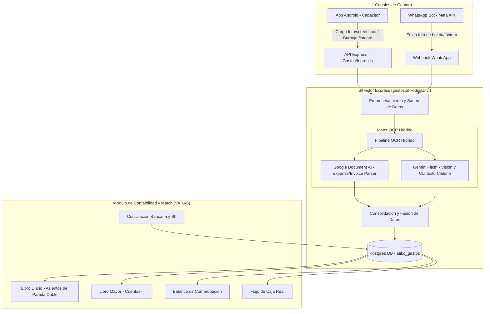
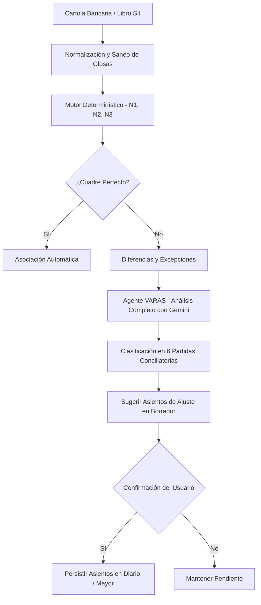

# 🍕 Plan de prueba end-to-end — Hash IA con cliente ficticio

## 🧠 Contextualización del Proyecto Hash IA y Arquitectura del Sistema

**Hash IA** es una plataforma integral SaaS multitenant diseñada por Atiko Digital para revolucionar la administración financiera, contable y comercial de las PyMEs chilenas. El sistema se divide en dos grandes familias funcionales:
1. **Hash IA Finanzas**: Permite a los negocios digitalizar sus gastos e ingresos mediante un pipeline OCR híbrido, automatizar su contabilidad de doble entrada de acuerdo con la normativa del SII, y conciliar de forma inteligente sus registros contra cartolas bancarias y los libros del SII.
2. **Hash IA Ventas**: Facilita la creación rápida de catálogos y el ingreso de pedidos por voz o foto, calculando el delivery automático por comunas de Chile y exportando resúmenes de pedidos en PDF compartibles vía WhatsApp.

### 🔌 Arquitectura Técnica y Flujo de Información

El ecosistema de Hash IA consta de tres componentes principales integrados:
* **Backend Node.js/Express (`gastos/`)**: Expuesto en `gastos.atikodigital.cl` detrás de un proxy inverso Caddy. Este servidor maneja la persistencia en Postgres, coordina las llamadas del pipeline OCR y aloja el motor de conciliación y contabilidad.
* **App Móvil Capacitor/Android (`gastos-app/`)**: Proporciona interfaces intuitivas para el ingreso de datos, incluyendo captura de fotos, importación de galería y un overlay persistente de captura de pantalla nativo de Android (burbuja flotante) adaptado de los plugins de captura de Matico.
* **Canal WhatsApp (`gastos/src/whatsapp`)**: Recibe imágenes directamente en el chat, identificando al tenant (empresa) por `phone_number_id` y al empleado emisor mediante un whitelist por número de celular, permitiendo una confirmación de datos interactiva en lenguaje natural.

Aquí se detalla el flujo de datos desde el ingreso de un documento hasta los libros contables:

### 🗄️ Estructura del Modelo de Datos (DB `atiko_gastos`)

El modelo relacional mantiene la separación lógica de los tenants mediante la columna `company_id`. Sus tablas más importantes son:
* `companies`: Registra las empresas activas, sus RUTs, credenciales de WhatsApp Business y configuraciones del resumen contable.
* `employees`: Administra la whitelist de números de teléfono autorizados para registrar gastos vía WhatsApp y sus credenciales de acceso a la app móvil.
* `expenses`: Almacena cada ingreso/gasto escaneado por el OCR, guardando montos en CLP (enteros en bigint), folios, RUT de emisor, proveedor, dirección, categoría y estado de confirmación.
* `cuentas`: Plan de cuentas sembrado por defecto con el estándar del SII Mipyme (Caja, Banco, IVA Crédito/Débito, Clientes, Proveedores, Ventas y Gastos del giro).
* `asientos` y `asiento_lineas`: Contabilidad real por partida doble. Cada registro en `asientos` (origen: expense, pago, conciliación, manual) debe cumplir estrictamente con la invariante `Σ debe == Σ haber` en sus líneas.
* `conciliaciones`: Almacena el resultado y auditoría de los cuadres de banco y SII.

### 🤖 Agentes Inteligentes y Lógica de Conciliación

El sistema cuenta con dos inteligencias artificiales que asumen roles especializados:
* **KALY (Asistente General)**: Tiene un tono cercano, habla en español chileno ("Señor Marco") y está orientada a la adquisición del usuario, el onboarding y la carga de inventarios o catálogos por voz.
* **VARAS (Controlador Financiero Autónomo)**: El motor principal del módulo **Match**. Su tono es profesional y contable. Gobierna de manera determinística e inteligente la conciliación bancaria y del SII en 3 capas:
    1. **Estandarización**: Convierte fechas y polaridades de cartolas a un formato canónico, saneando glosas bancarias para evitar ataques de prompt-injection.
    2. **Motor Determinístico**: Realiza cruces automáticos de transacciones en base a correspondencias exactas (N1), tolerancia de fecha y redondeo de montos (N2), o desagregación de pagos masivos agrupados (N3).
    3. **Análisis de Excepciones por IA ("IA revisa todo")**: Gemini procesa el estado de cuenta y el libro auxiliar completo en una sola llamada de contexto, clasificando los descalces en la taxonomía contable (cheques y depósitos en tránsito, comisiones bancarias, depósitos no identificados, errores internos o bancarios) y sugiriendo asientos de ajuste en borrador. **Ningún asiento se persiste sin la aprobación manual (1 clic) del usuario**.

### 🔬 Mapeo de Casos de Prueba con Componentes de Código

Para guiar la validación técnica y el control de calidad, a continuación se mapea cada sección de este plan de prueba con las rutas y componentes de código que gobiernan dicha funcionalidad:

| Sección del Plan | Archivos en Backend (`gastos/src/`) | Archivos en Frontend (`gastos-app/src/`) | Propósito / Lógica Bajo Prueba |
| :--- | :--- | :--- | :--- |
| **2. Onboarding** | [onboarding/](file:///c:/Users/josea/Desktop/proyectos/paginas%20web/atiko/HASH%20IA/gastos/src/onboarding) | [GastosApp.jsx](file:///c:/Users/josea/Desktop/proyectos/paginas%20web/atiko/HASH%20IA/gastos-app/src/gastos/GastosApp.jsx) | Registro inicial de datos, configuración de empresa y plan de cuentas. |
| **3. Compras (Gastos)** | [expenses/](file:///c:/Users/josea/Desktop/proyectos/paginas%20web/atiko/HASH%20IA/gastos/src/expenses), [ocr/](file:///c:/Users/josea/Desktop/proyectos/paginas%20web/atiko/HASH%20IA/gastos/src/ocr) | [EvidenceIntake.jsx](file:///c:/Users/josea/Desktop/proyectos/paginas%20web/atiko/HASH%20IA/gastos-app/src/components/EvidenceIntake.jsx) | Preprocesamiento local, OCR híbrido, categorías automáticas y deduplicación. |
| **4. Ventas (Ingresos)** | [expenses/](file:///c:/Users/josea/Desktop/proyectos/paginas%20web/atiko/HASH%20IA/gastos/src/expenses) | [EvidenceIntake.jsx](file:///c:/Users/josea/Desktop/proyectos/paginas%20web/atiko/HASH%20IA/gastos-app/src/components/EvidenceIntake.jsx) | Reconocimiento de tipo de DTE (ingreso vs egreso), lectura de clientes y montos. |
| **5. Kaly (Voz)** | [varas/](file:///c:/Users/josea/Desktop/proyectos/paginas%20web/atiko/HASH%20IA/gastos/src/varas), [chat/](file:///c:/Users/josea/Desktop/proyectos/paginas%20web/atiko/HASH%20IA/gastos/src/chat) | [ChatView.jsx](file:///c:/Users/josea/Desktop/proyectos/paginas%20web/atiko/HASH%20IA/gastos-app/src/gastos/ChatView.jsx) | Transcripción de audio, extracción de entidades y confirmación conversacional. |
| **6. Remuneraciones / Pagos** | [contabilidad/](file:///c:/Users/josea/Desktop/proyectos/paginas%20web/atiko/HASH%20IA/gastos/src/contabilidad) | [MatchView.jsx](file:///c:/Users/josea/Desktop/proyectos/paginas%20web/atiko/HASH%20IA/gastos-app/src/gastos/MatchView.jsx) | Asociación de transferencias de egreso, categorización a sueldos y arriendos. |
| **7. Conciliación Bancaria** | [match/](file:///c:/Users/josea/Desktop/proyectos/paginas%20web/atiko/HASH%20IA/gastos/src/match) | [MatchView.jsx](file:///c:/Users/josea/Desktop/proyectos/paginas%20web/atiko/HASH%20IA/gastos-app/src/gastos/MatchView.jsx) | Cuadrante SCA vs SBA, generación de asientos de comisión/tránsito y match de depósitos. |
| **8. Reportes Contables** | [contabilidad/](file:///c:/Users/josea/Desktop/proyectos/paginas%20web/atiko/HASH%20IA/gastos/src/contabilidad), [panel/](file:///c:/Users/josea/Desktop/proyectos/paginas%20web/atiko/HASH%20IA/gastos/src/panel) | [ContabilidadView.jsx](file:///c:/Users/josea/Desktop/proyectos/paginas%20web/atiko/HASH%20IA/gastos-app/src/gastos/ContabilidadView.jsx) | Generación del Diario, Mayor, Balance general cuadrado y Flujo de caja conciliado. |
| **9. Casos de Error OCR** | [ocr/](file:///c:/Users/josea/Desktop/proyectos/paginas%20web/atiko/HASH%20IA/gastos/src/ocr) | [EvidenceIntake.jsx](file:///c:/Users/josea/Desktop/proyectos/paginas%20web/atiko/HASH%20IA/gastos-app/src/components/EvidenceIntake.jsx) | Tolerancia del OCR a imágenes degradadas y control de inputs inválidos en UI. |
| **10. Casos Avanzados** | [match/](file:///c:/Users/josea/Desktop/proyectos/paginas%20web/atiko/HASH%20IA/gastos/src/match), [contabilidad/](file:///c:/Users/josea/Desktop/proyectos/paginas%20web/atiko/HASH%20IA/gastos/src/contabilidad) | [MatchView.jsx](file:///c:/Users/josea/Desktop/proyectos/paginas%20web/atiko/HASH%20IA/gastos-app/src/gastos/MatchView.jsx) | Comprobación de notas de crédito (restar), exenciones de IVA, RUTs y fechas. |
| **12. Conciliación SII** | [match/](file:///c:/Users/josea/Desktop/proyectos/paginas%20web/atiko/HASH%20IA/gastos/src/match) | [MatchView.jsx](file:///c:/Users/josea/Desktop/proyectos/paginas%20web/atiko/HASH%20IA/gastos-app/src/gastos/MatchView.jsx) | Lectura del Libro SII, identificación de DTE faltantes y proponer auto-creación. |

---

**Cliente de prueba:** Pizzería Bella Napoli SpA · **Período:** Junio 2026
**Objetivo:** Probar la experiencia de usuario completa (no el código) subiendo documentos reales por el celular, igual que un cliente de verdad: desde el alta de la empresa hasta la conciliación bancaria al 30 de junio y los reportes.

> Tienes **79 documentos** en la carpeta `documentos/`:
> - **37 “normales”** (01–37) — un mes coherente: RUT válidos (mód-11), neto + IVA = total, y la cartola cuadra con ventas/compras/sueldos/arriendo, **excepto 3 diferencias** para probar la conciliación.
> - **8 casos de error** (38–45) — documentos borrosos, oscuros, cortados, etc., para ver **cómo reacciona la app cuando NO puede leer bien**.
> - **22 casos de estudio** (46–67) — documentos diseñados para apuntar a **4 puntos débiles detectados en el código** (notas de crédito, validación de RUT, IVA inventado, conciliación avanzada). Ver sección 10.
> - **7 insumos de pizzería** (68–74) — compras de ingredientes (levadura, salsa, aceite, embutidos…) pagadas en efectivo. Ver sección 11.
> - **5 vouchers de tarjeta** (75–79) — comprobantes Transbank; su abono se refleja en la cartola **neto de comisión**. Ver sección 11.
> - **2 libros SII** (80–81) — Libro de Compras y Libro de Ventas para la **conciliación SII** (incluyen 2 facturas fantasma para probar la detección de faltantes). Ver sección 12.

---

## 0. Datos de la empresa ficticia (cópialos en el onboarding)

| Campo | Valor |
|---|---|
| **Razón social** | PIZZERÍA BELLA NAPOLI SpA |
| **Nombre / fantasía** | Bella Napoli |
| **RUT** | 77.123.456-9 |
| **Giro / rubro** | Restaurante – Elaboración y venta de pizzas |
| **Dirección** | Av. Italia 1234, Providencia, Santiago |
| **Dueño** | Marco Rossi |
| **WhatsApp dueño** | +56 9 6123 4567 |
| **Banco** | Banco de Chile – Cuenta Corriente 000-12345-67 |
| **¿Precios incluyen IVA?** | Sí |
| **¿Hace delivery?** | Sí |

**Empleados (para remuneraciones):**

| Nombre | Cargo | RUT | Sueldo líquido |
|---|---|---|---|
| Juan Pérez Muñoz | Pizzero | 15.234.567-? | $620.000 |
| Carlos Soto Vega | Pizzero | 16.345.678-? | $560.000 |
| María González Rojas | Cajera | 17.456.789-? | $480.000 |
| Pedro Ramírez Díaz | Repartidor | 18.567.890-? | $450.000 |

---

## 1. Preparación (5 min)

1. Pasa las **81 imágenes** de la carpeta `documentos/` a tu celular (las puedes enviar por WhatsApp a ti mismo, subirlas a Google Fotos, o copiarlas por cable a la galería).
2. Instala / abre el **APK de Hash IA** en el Android.
3. Ten a mano este plan y el archivo `MANIFIESTO.csv` (la “hoja de respuestas”: qué dato debería leer el OCR de cada documento).

> 💡 **Tip de experiencia real:** algunos documentos están en estilo *“foto de papel”* (boletas de verduras, Copec, boletas de público) y otros *digitales nítidos*. Súbelos mezclados, como llegarían en la vida real.

---

## 2. Onboarding — alta de la empresa (5 min)

1. Login en la app (usuario + contraseña de prueba).
2. Completa el **asistente de onboarding (Kaly)** con los datos de la tabla del punto 0.
3. **A evaluar (UX):**
   - [ ] ¿Los 5 pasos se entienden sin explicación?
   - [ ] ¿Kaly te trata bien (Señor Marco / por tu nombre)?
   - [ ] ¿Puedes volver atrás a corregir un dato?
   - [ ] ¿Quedó guardada la empresa al terminar (no te lo vuelve a pedir al reabrir)?

---

## 3. Carga de COMPRAS → gastos (documentos 01–18)

Sube cada documento por **Captura** (foto/galería). En cada uno, revisa la pantalla de **confirmación** contra el `MANIFIESTO.csv`.

**Lo que debes verificar en cada gasto:**
- [ ] Leyó bien **RUT emisor, proveedor, folio, fecha**.
- [ ] **Neto, IVA y Total** correctos (ej. doc 01: neto $380.000 · IVA $72.200 · total $452.200).
- [ ] Sugirió una **categoría** razonable (Mercadería / Servicios básicos / Arriendo / Combustible / Insumos).
- [ ] Lo marcó como **gasto** (no ingreso).

**Casos especiales a probar:**
- **Documentos 05, 06, 07, 17, 18** (estilo foto de papel) → ¿el OCR sufre con la foto inclinada? ¿pide corrección?
- **Documento 13 (arriendo, $1.428.000)** → ¿lo categoriza como *Arriendo*?
- **Deduplicación:** sube **dos veces el documento 03** (Soprole folio 88231). La segunda vez la app debería avisar *“ya lo registré”* (match por folio + RUT). Prueba el botón **“registrar igual”**.

---

## 4. Carga de VENTAS → ingresos (documentos 19–29)

- **19–24:** facturas emitidas a empresas (Constructora Andes, Colegio San Marcos, Soluciones TI, Clínica Vida Plena, Municipalidad, Banco Estado).
- **25–29:** boletas de público (muestras de ventas mostrador).

**A verificar:**
- [ ] La app las reconoce como **ingreso / venta** (no gasto).
- [ ] En las facturas, lee el **cliente (receptor)** y el IVA débito.
- [ ] El botón **“es un ingreso / es un gasto”** invierte el tipo si se equivoca.

---

## 5. Kaly — dictado por voz (3 min)

Prueba el registro **sin foto**, hablándole a Kaly. Di textualmente:

> *“Kaly, registra una compra de 30 kilos de queso a Soprole por 90 mil pesos, pagada en efectivo.”*

**A evaluar:**
- [ ] Extrae proveedor (*Soprole*), monto ($90.000), infiere categoría (*Mercadería*) e IVA.
- [ ] **Pide confirmación** antes de guardar (“¿Confirmo, Señor Marco?”).
- [ ] Pregunta **estado de pago** (pagado/pendiente) — al decir *efectivo*, lo marca pagado por Caja.
- [ ] Prueba también: *“¿cuánto llevo gastado este mes?”* → ¿responde con un resumen?

---

## 6. Remuneraciones, arriendo y pagos (documentos 30–35)

Comprobantes de transferencia del Banco de Chile:
- **30–33:** sueldos de los 4 empleados (pagados 30/06).
- **34:** arriendo a Inmobiliaria Providencia ($1.428.000).
- **35:** pago a Envases del Pacífico ($214.200) — **⚠️ este es una de las 3 diferencias** (girado el 30/06, el banco aún no lo cobra).

**A evaluar:**
- [ ] ¿Cómo registra la app un **sueldo**? (¿categoría Remuneraciones? ¿egreso manual?)
- [ ] ¿Puedes asociar el comprobante de pago del arriendo con la factura de arriendo (doc 13)?

> Si la app aún no tiene flujo de remuneraciones, anótalo como hallazgo de UX (es función de fase 2 según el roadmap).

---

## 7. Conciliación bancaria al 30/06 (documento 37) — ⭐ la prueba clave

1. Ve a **Match → Cartola bancaria**.
2. Sube el documento **37 (cartola Banco de Chile junio)** + el **36 (comprobante de depósito en tránsito)**.
3. La app debería cuadrar los 24 movimientos del banco contra lo que registraste y **detectar exactamente 3 diferencias**:

| # | Diferencia | Monto | Tipo de ajuste esperado |
|---|---|---|---|
| 1 | **Comisión mantención cuenta** (está en el banco, no la registraste) | $9.500 | Nota débito |
| 2 | **Depósito en tránsito** (lo registraste, el banco lo acredita el 01/07) | $720.000 | Depósito en tránsito |
| 3 | **Pago a Envases** girado el 30/06, no cobrado por el banco | $214.200 | Cheque/transf. girado no cobrado |

**Números esperados (tu “hoja de respuestas”):**
- Saldo inicial banco (01/06): **$3.200.000**
- Total abonos: **$10.250.400** · Total cargos: **$6.460.750** (incluyen los abonos Transbank brutos y sus comisiones)
- **Saldo final banco 30/06: $6.989.650**
- Saldo banco **ajustado** = 6.989.650 + 720.000 − 214.200 = **$7.495.450**
- Saldo libros **ajustado** (menos comisión $9.500) = **$7.495.450** ✅ **cuadra**

**A evaluar (UX):**
- [ ] ¿La app muestra la **brecha** y propone los 3 ajustes claros?
- [ ] ¿Puedes crear cada **asiento de ajuste con 1 clic**?
- [ ] Tras aceptar los 3, ¿queda **“Banco cuadrado ✔”**?

---

## 8. Reportes VARAS (3 min)

Revisa **Contabilidad / Reportes** y contrasta con estos totales del mes:

| Concepto | Valor esperado |
|---|---|
| Compras (gastos) – neto | $4.450.126 |
| IVA crédito (compras) | $845.523 |
| Ventas facturas – neto | $2.480.000 |
| IVA débito (ventas) | $471.200 |
| Ventas boletas – total | $202.200 |
| Sueldos (4 empleados) | $2.110.000 |
| **IVA F29** (débito − crédito) | **−$374.323** (remanente a favor) |

**A evaluar:**
- [ ] ¿Cuadran (aprox.) Diario, Mayor, Balance y Flujo?
- [ ] ¿El Balance “cuadra” (activo = pasivo + patrimonio)?

---

## 9. Casos de error — estrés del OCR (documentos 38–45) ⭐

Estos 8 documentos están **dañados a propósito**. Súbelos por **Captura** uno por uno. Lo importante NO es que el OCR acierte, sino **cómo reacciona cuando no puede leer**: ¿avisa con un mensaje claro?, ¿pide que repitas la foto?, ¿deja editar a mano?, ¿o inventa un dato equivocado (lo peor)?

| Doc | Problema | Comportamiento esperado / a evaluar |
|---|---|---|
| **38** | Factura **muy borrosa** (fuera de foco) | ¿Detecta baja confianza y avisa, o inventa montos? |
| **39** | Factura **muy oscura** (subexpuesta) | ¿Pide mejor iluminación / repetir foto? |
| **40** | Factura con **reflejo/brillo** que borra parte | ¿Lee lo legible y marca lo demás como dudoso? |
| **41** | Foto **cortada**: falta el TOTAL | ¿Avisa “no encontré el total” o lo deja en $0 para editar? |
| **42** | **Dedo tapando** el monto total | ¿Detecta que falta el total? ¿lo deja editable? |
| **43** | **Boleta escrita a mano** | ¿Lee algo del manuscrito? ¿permite ingresarlo manual? |
| **44** | Documento **arrugado** | ¿Tolera la deformación o falla? |
| **45** | **No es un documento** (foto de una pizza) | ⚠️ Clave: debería decir **“no encontré una boleta/factura”** y NO crear un gasto fantasma. |

**A evaluar (UX):**
- [ ] ¿En ningún caso la app **inventó** un número que tú no puedes verificar?
- [ ] ¿Siempre hubo una **salida clara** (reintentar, editar a mano, o descartar)?
- [ ] El doc 45 (no es documento): ¿lo **rechazó** correctamente?
- [ ] ¿Algún caso de error **crasheó** la app o se quedó “pensando” sin responder?

> 💡 Anota textual el mensaje que muestra la app en cada caso. Eso te dice qué tan robusto es el OCR frente a fotos malas (que en la vida real son MUY comunes).

---

## 10. Casos de estudio avanzados (documentos 46–67) ⭐⭐

Estos documentos apuntan a **4 puntos débiles detectados leyendo tu código**. Para cada caso anota: **qué dato extrajo la app** y **si avisó de algo**. La columna "hipótesis" es lo que el código sugiere que pasará — confírmalo o desmiéntelo.

### Suite A — Correctitud contable (docs 46–51)
> Hallazgo: en `extract.js` el tipo solo es gasto/ingreso; las notas de crédito **no cambian de signo**. En `money.js`, si lee neto y total, **recalcula el IVA** ignorando el del documento.

| Doc | Caso | Qué verificar / hipótesis |
|---|---|---|
| 46 | **Nota de crédito recibida** (Soprole −$80.000) | ¿La **resta** del gasto/IVA crédito o la **suma** como un gasto más? (hipótesis: la suma → infla) |
| 47 | **Nota de crédito emitida** (a Colegio −$50.000) | ¿Resta de las ventas o la suma como ingreso? |
| 48 | **Nota de débito recibida** (Andina +$30.000) | ¿La asocia a la factura original? |
| 49 | **Factura exenta** (seguro $300.000, IVA $0) | ⚠️ ¿Respeta IVA $0 o **inventa $57.000 de IVA**? |
| 50 | **Boleta de honorarios** (bruto $200.000, líquido $172.500) | ¿Registra $172.500 o $200.000? ¿Reconoce la **retención** $27.500? Categoría esperada: *Honorarios* |
| 51 | **Factura mixta** (afecto $200.000 + exento $100.000) | ¿IVA = $38.000 (solo sobre lo afecto)? |

### Suite B — Validación OCR (docs 52–60)
> Hallazgo: `extract.js` usa `normalizeRut` (no valida DV). `parseFecha` solo acepta `YYYY-MM-DD` o `D/M/YYYY`.

| Doc | Caso | Qué verificar / hipótesis |
|---|---|---|
| 52 | **RUT inválido** (78.901.234-**5**, el correcto es -2) | ⚠️ ¿Lo acepta sin avisar? (hipótesis: sí, no valida DV) |
| 53 | **Total ≠ neto + IVA** (100.000 + 19.000 = muestra 130.000) | ¿Lo "corrige" en silencio o avisa de la inconsistencia? |
| 54 | **Fecha en texto** ("4 de junio de 2026") | ⚠️ ¿Pierde la fecha? (hipótesis: queda vacía) |
| 55 | **RUT con dígito K** (20.000.003-K, válido) | ¿Lo acepta bien? |
| 56 | **Factura de JULIO** (fuera del período) | ¿La mete en junio? ¿avisa que es de otro mes? |
| 57 + 58 | **Mismo folio 5000, distinto proveedor** (Vega y Copec) | NO deben fusionarse (dedup es folio + RUT) |
| 59 + 60 | **Mismo proveedor + mismo monto, distinto día** (Molinera $200.000 el 03 y el 17) | ¿Bloquea el 2° como duplicado siendo compras reales distintas? |

### Suite C — Conciliación avanzada (docs 61–63)
> Sube las 2 facturas (61, 62) como ingresos, ten en cuenta la factura Clínica (doc 22), y luego concilia con la **cartola de casos** (63) en **Match → Cartola**.

| Línea en la cartola 63 | Caso | Qué verificar |
|---|---|---|
| Abono **$914.000** "Eventos del Sur" | **1 abono = 2 facturas** (61: $380.800 + 62: $533.200) | ¿Las asocia ambas o queda excepción? |
| Abono **$300.000** "Clínica Vida Plena" | **Pago parcial** (la factura 22 es de $606.900) | ¿Concilia parcial y deja $306.900 pendiente? |
| 2× cargo **$113.050** "Abastible" | **Cargo duplicado por el banco** | ¿Propone ajuste `error_banco`? |
| Cargo **$500.000** "Cuenta propia ahorro" | **Transferencia entre cuentas propias** | No es gasto → ¿lo marca excepción y NO crea gasto? |
| Cargo **$168.000** "Ferretería El Clavo" | **Compra que NO subiste** | ⚠️ ¿Detecta "te falta registrar este gasto"? |

### Suite D — Negocio pizzería (docs 64–67)
| Doc | Caso | Qué verificar / hipótesis |
|---|---|---|
| 64 | **Activo fijo** (horno $2.500.000 + IVA) | ¿Lo trata como gasto del mes o reconoce que es **activo fijo** (no es gasto)? (hipótesis: lo manda a "Otros gastos") |
| 65 | **Gasto no deducible** (almuerzo personal $95.000) | ¿Lo marca como rechazado/no deducible o lo deduce igual? |
| 66 | **Estado de tarjeta de crédito** (no es cartola ni DTE) | ⚠️ ¿Lo confunde con una cartola/factura o lo identifica bien? |
| 67 | **Boleta con propina** (venta $38.000 + propina $3.800) | ¿El IVA se calcula solo sobre los $38.000? La propina no es venta afecta |

### Suite E — Kaly / voz (sin documentos, dictado)
| # | Di esto a Kaly | Qué verificar |
|---|---|---|
| E1 | *"Gasté como 50 lucas en cosas para la pizzería"* | ¿Pide aclarar proveedor/categoría en vez de inventar? |
| E2 | *"Registra una venta de 80 mil pesos a una oficina, pagada por transferencia"* | ¿La marca como **ingreso**? |
| E3 | *"Compré queso por 40 mil… no, eran 60 mil"* | ¿Toma la **corrección** ($60.000)? |
| E4 | *"Marca como pagada la última compra de harina"* | ¿Pide confirmación antes de cambiar el estado? |
| E5 | *"¿Cuánto debo de IVA este mes?"* | ¿Responde con un número coherente? |
| E6 | En onboarding, escribe un **RUT inválido** | ¿Lo valida y lo rechaza? |
| E7 | *(WhatsApp)* manda una foto desde un número **no registrado** | ¿La ignora/rechaza? |

### Suite F — Volumen y robustez
| # | Acción | Qué verificar |
|---|---|---|
| F1 | Sube **10 documentos seguidos** sin esperar | ¿Los encola sin perder ninguno? |
| F2 | **Re-sube todo el lote** del 01 al 18 | ¿Bloquea los 18 por duplicado? |
| F3 | Sube una **foto enorme** (>10 MB) | ¿La comprime o la rechaza con mensaje claro? |
| F4 | Corta el **WiFi/datos** a mitad de una subida | ¿Reintenta? ¿queda el gasto a medias? |

> 💡 Los casos marcados con ⚠️ son los de **mayor probabilidad de falla** según el código. Si fallan, ya sabes exactamente qué archivo arreglar (te dejé las referencias en el chat).

---

## 11. Insumos de pizzería y vouchers de tarjeta

### Compras de ingredientes (docs 68–74) — pagadas en EFECTIVO
Facturas de los insumos típicos de una pizzería. Súbelas como **gastos**. Como se pagan en efectivo (caja), **no aparecen en la cartola** y no afectan el cuadre del 30‑jun.

| Doc | Proveedor | Contenido | Neto | Categoría esperada |
|---|---|---|---|---|
| 68 | Distribuidora Don Vito | salsa de tomate, aceite de oliva, orégano, aceitunas, anchoas | $200.000 | Mercadería e insumos del giro |
| 69 | Levaduras y Masas | levadura fresca, mejorador de masa, sémola | $85.000 | Mercadería e insumos del giro |
| 70 | Frigorífico La Pampa | pepperoni, jamón, salame, tocino | $340.000 | Mercadería e insumos del giro |
| 71 | El Champiñón | champiñón, pimentón, cebolla, choclo | $90.000 | Mercadería e insumos del giro |
| 72 | Molinera Lo Valledor | harina + levadura seca | $315.000 | Mercadería e insumos del giro |
| 73 | Don Vito (restock) | salsa, aceite, aceitunas, orégano | $92.000 | Mercadería e insumos del giro |
| 74 | Municipalidad Providencia | patente comercial (**EXENTA**, sin IVA) | $185.000 | Contribuciones, patentes e impuestos |

> Verifica que el OCR lea las **múltiples líneas** de cada factura, y que el doc 74 (patente) lo trate como **exento** (sin IVA) y categoría *Contribuciones/patentes*.

### Vouchers de pago con tarjeta (docs 75–79) + comisión Transbank ⭐
Comprobantes Transbank de ventas con tarjeta. El banco abona el dinero **neto de comisión**: en la cartola (doc 37) cada `ABONO TRANSBANK (BRUTO)` viene seguido de su `COMISION TRANSBANK + IVA`.

- **Con los vouchers:** ¿la app reconoce un voucher como respaldo de una venta con tarjeta? ⚠️ ¿Evita **duplicar** la venta si el abono Transbank ya está en la cartola? (un voucher NO es una venta extra: el dinero ya entra por el depósito Transbank).
- **Comisión Transbank del mes: $144.000** (35.000 + 36.000 + 39.000 + 34.000). Deberían poder registrarse como **Gastos financieros** o aparecer como ajuste `nota_débito` en la conciliación. ¿La app las detecta y propone el asiento?
- El saldo final de la cartola **no cambia** ($6.989.650): bruto − comisión = el neto de antes.

---

## 12. Conciliación SII — Libro de Compras y Ventas (docs 80–81) ⭐

Tu app tiene un modo específico: **Match → Libro Compras/Ventas SII**. Sube el libro y la app compara contra lo que registraste, proponiendo **crear los movimientos que faltan**.

- **Doc 80 — Libro de Compras** (25 documentos · neto $8.014.101 · IVA crédito $1.487.529)
- **Doc 81 — Libro de Ventas** (10 documentos · neto $10.198.047 · IVA débito $1.937.633)

### Lo que debe detectar (tu "hoja de respuestas")
| En el libro | ¿Lo subiste? | Resultado esperado |
|---|---|---|
| Compras 01–18, insumos 68–74, horno, NC/ND | Sí | Deben **cuadrar** con tus gastos |
| **Factura 7012 — Comercial El Trigal ($140.000)** | ❌ NO | ⚠️ "Falta registrar" → ofrecer crearla |
| **Factura 8890 — Distribuidora Polar Frío ($95.000)** | ❌ NO | ⚠️ Idem: proponer crear el movimiento |
| Ventas 121–128, NC 130, boletas | Sí | Deben cuadrar con tus ingresos |

### A evaluar (UX)
- [ ] ¿Lee la **tabla completa** (25 / 10 filas) sin perder documentos?
- [ ] ¿Detecta las **2 facturas fantasma** y ofrece crearlas con 1 clic?
- [ ] ¿Maneja las **notas de crédito en negativo** (no las suma como una compra/venta más)?
- [ ] ¿El IVA crédito ($1.487.529) y débito ($1.937.633) coinciden con lo que muestra la app?
- [ ] ¿La factura **exenta** (patente) la trata sin IVA?

---

## 13. Checklist final de EXPERIENCIA DE USUARIO

No estás probando código — estás probando si **un dueño de pizzería de verdad podría usar esto solo**. Marca lo que falle:

- [ ] ¿Cuántos **toques** te tomó cargar un gasto desde la foto? ¿Se siente rápido?
- [ ] ¿El OCR **falló** en algún documento? ¿Cuál y por qué (foto, número, RUT)?
- [ ] ¿Las **categorías** sugeridas tienen sentido para una pizzería?
- [ ] ¿Kaly fue **útil o molesta**? ¿El micrófono se prende/apaga cuando corresponde?
- [ ] ¿La **conciliación** se entiende sin saber contabilidad?
- [ ] ¿Hubo algún momento donde **no supiste qué hacer**?
- [ ] ¿Confiarías en los números para tu F29?

> Anota cada fricción. Eso es lo más valioso de esta corrida.

---

### Anexos en esta carpeta
- `documentos/` → las 81 imágenes (01–37 normales, 38–45 casos de error, 46–67 casos de estudio A/B/C/D, 68–74 insumos pizzería, 75–79 vouchers de tarjeta, 80–81 libros SII; numeradas en orden de uso).
- `documentos/MANIFIESTO.csv` → hoja de respuestas: dato esperado por documento.
- `generador/` → el generador (data.js + render.js). Si quieres **más documentos, otro mes u otro rubro**, se editan los datos y se regenera.
